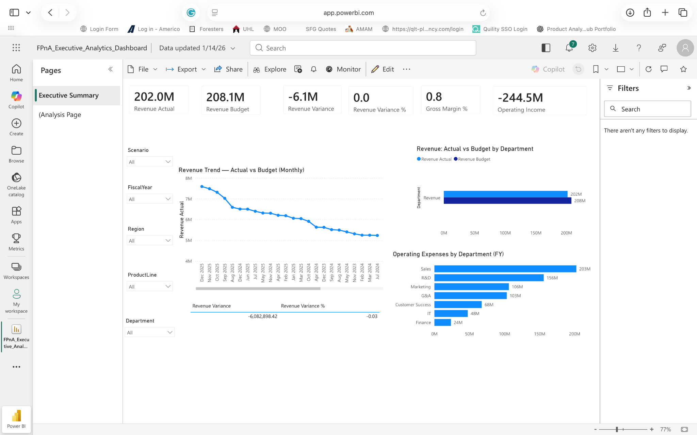
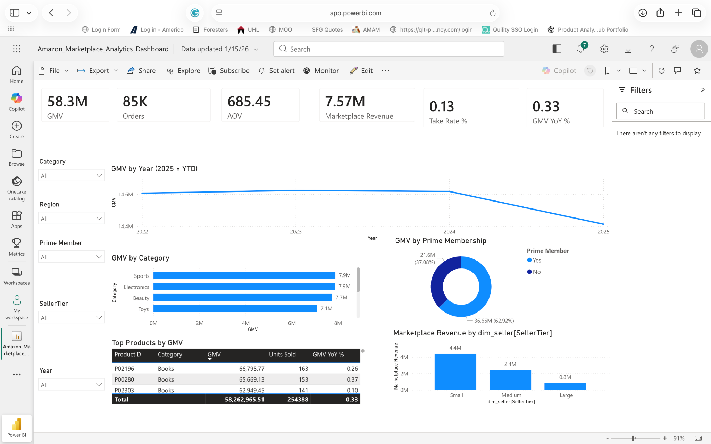

# 📊 Financial Analyst Portfolio  
### FP&A • Forecasting • Variance Analysis • Executive Reporting

Welcome to my job-ready **Financial Analyst Portfolio**. This repository showcases practical, real-world-style work across core finance analytics areas:

- Financial Planning & Analysis (FP&A)  
- Budgeting, forecasting, and scenario modeling  
- Budget vs Actual and variance analysis  
- Executive reporting and KPI dashboards  
- Data-driven insights for business decision-making  
- SQL-supported analysis and Python-assisted workflows  

**Typical stakeholders supported:** Finance leadership (Director/VP Finance), business partners, and operating teams.  
**Monthly cadence demonstrated:** Month-end performance review → variance analysis → insights → forecast refresh / decision support.

> **Portfolio Hub:** Open the portfolio hub → **[Financial_Analytics_Portfolio/README.md](Financial_Analytics_Portfolio/README.md)**

---

## 👋 About Me

I’m a Financial Analyst focused on turning financial and operational data into **clear, decision-ready insights**. I build models, analyses, and reporting that help leaders understand performance drivers, budget variance, and opportunities to improve profitability and efficiency.

**Core Skills**
- 📊 Financial Analysis & FP&A  
- 📈 Forecasting & Budgeting  
- 📌 Variance Analysis & KPI Tracking  
- 🧠 SQL Data Modeling & Python Analytics  
- 📉 Power BI & Tableau Visualizations  
- 📁 Executive Reporting & Storytelling  

---

## 🧭 Portfolio Map (How to Review)

If you’re a recruiter or hiring manager, here’s the fastest way to review:

1. **Go to the portfolio hub**: **[Financial_Analytics_Portfolio](Financial_Analytics_Portfolio/)**  
2. Pick a project below (each has its own README).  
3. Look for a **Results / Insights** section and any exported visuals (charts, screenshots, deliverables).

---

## 📂 Featured Projects

### 📌 01 – FP&A Executive Dashboard
**Business Focus:** Simulates an internal FP&A dashboard used by finance leadership to monitor performance and budget adherence.  
**Highlights:** KPI tracking, variance analysis, trend identification, executive reporting.  
**Results / Impact (FP&A-focused):**
- Improved Budget vs Actual review by breaking variances into clear drivers (department, month, and category-level views).  
- Created a leadership-ready KPI package to support month-end performance conversations and forecast updates.  
**Project folder:** **[Financial_Analytics_Portfolio/01_FPA_Executive_Dashboard](Financial_Analytics_Portfolio/01_FPA_Executive_Dashboard/)**

---

### 📌 02 – Amazon Marketplace Financial Analytics
**Business Focus:** Financial analytics for marketplace economics, including revenue, seller performance, and profitability drivers.  
**Highlights:** Category profitability, margin drivers, seller segmentation performance.  
**Results / Impact (Finance + Business/Data Analyst):**
- Built profitability views (revenue, margin, contribution) by category/segment to highlight where performance is driven.  
- Identified mix and margin drivers that can inform planning assumptions (growth focus, fee/pricing levers, cost-to-serve).  
**Project folder:** **[Financial_Analytics_Portfolio/02_Amazon_Marketplace_Analytics](Financial_Analytics_Portfolio/02_Amazon_Marketplace_Analytics/)**

---

### 📌 03 – Profitability and COGS Analysis
**Business Focus:** Deep-dive into cost structures and gross margin optimization.  
**Highlights:** Cost driver identification, margin decomposition, recommendations to improve margin performance.  
**Results / Impact (FP&A / margin story):**
- Decomposed gross margin movement into pricing, volume, mix, and cost impacts to explain *why* margin changed.  
- Prioritized COGS drivers to support targeted actions and scenario analysis for margin improvement.  
**Project folder:** **[Financial_Analytics_Portfolio/03_Profitability_and_COGS_Analysis](Financial_Analytics_Portfolio/03_Profitability_and_COGS_Analysis/)**

---

### 📌 04 – Executive Financial Performance Reporting
**Business Focus:** Board-style financial reporting geared toward executive stakeholders.  
**Highlights:** High-level performance summaries, trend analysis, leadership-focused storytelling.  
**Results / Impact (executive reporting):**
- Produced an executive-ready monthly performance narrative: key KPIs, trend commentary, and notable variances.  
- Connected financial outcomes to business drivers to support leadership decisions and forecast adjustments.  
**Project folder:** **[Financial_Analytics_Portfolio/04_Executive_Financial_Performance](Financial_Analytics_Portfolio/04_Executive_Financial_Performance/)**
---
## 🖼️ Dashboard Previews

---

## 📈 What This Portfolio Demonstrates

This portfolio is structured to show:

- How financial data is turned into **meaningful business insights**  
- Analyst-level understanding of budgeting, forecasting, and performance management  
- Ability to build professional dashboards for decision support  
- Structured analysis and models that reflect real corporate workflows  
- Clear documentation and executive-style communication  

---

## 📬 Contact

- **LinkedIn:** https://www.linkedin.com/in/jamiechristian2  
- **GitHub:** https://github.com/JamieChristian22  

---
If you’d like, I can tailor a version of this README for a specific target role (FP&A Analyst vs Financial Analyst vs Finance Business/Data Analyst) and adjust keywords accordingly.
